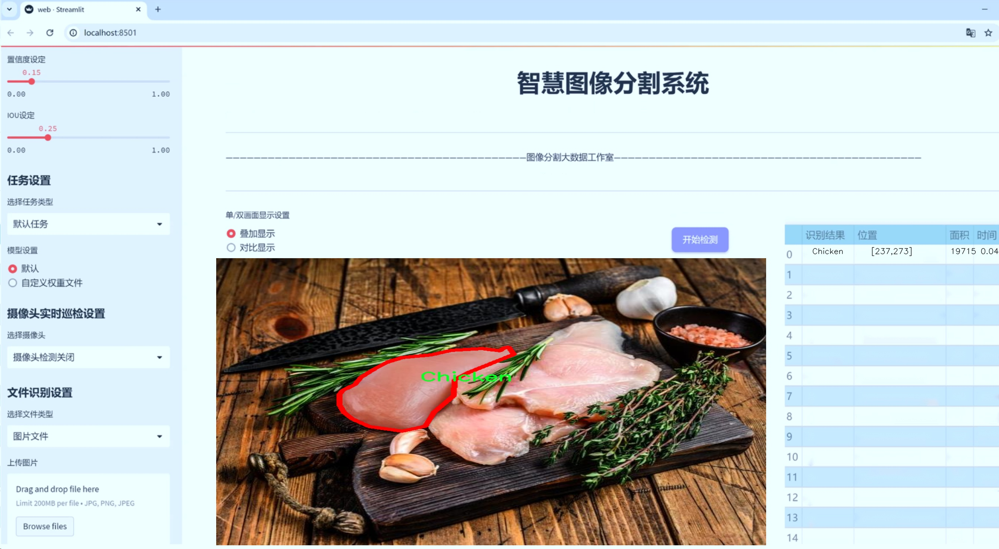
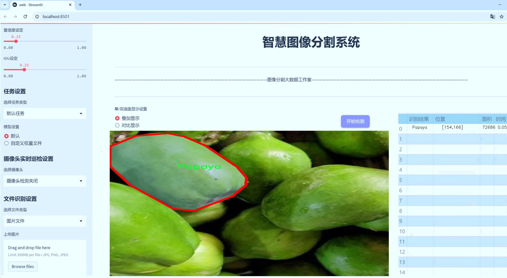
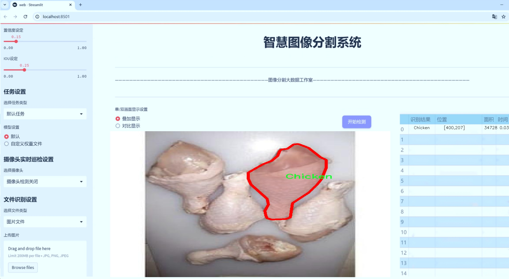
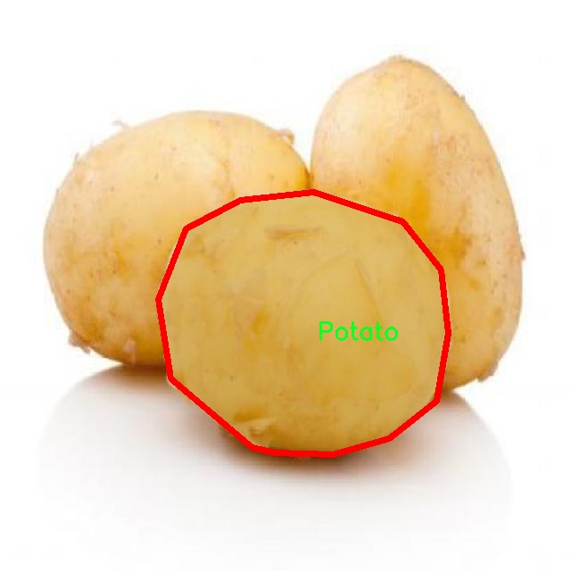
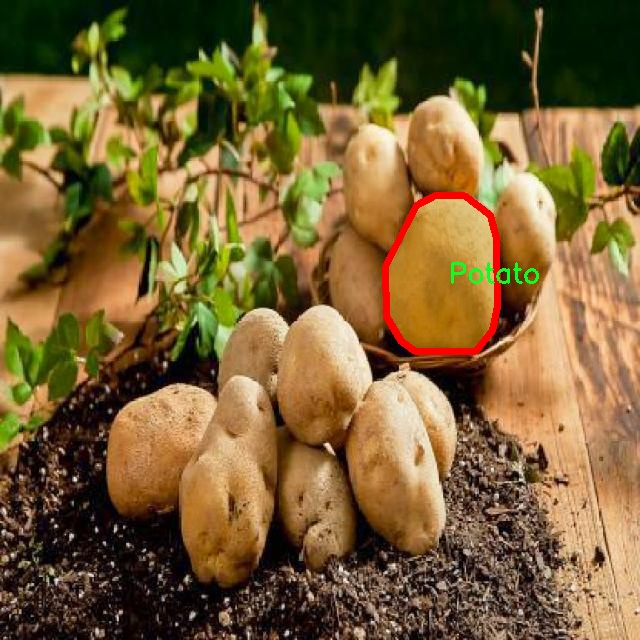
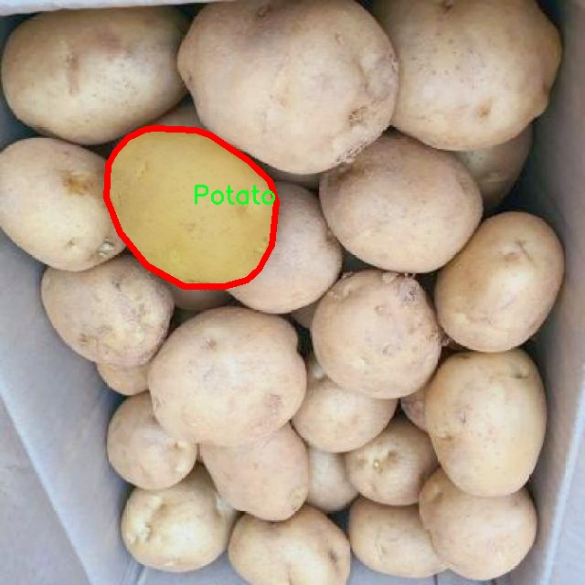
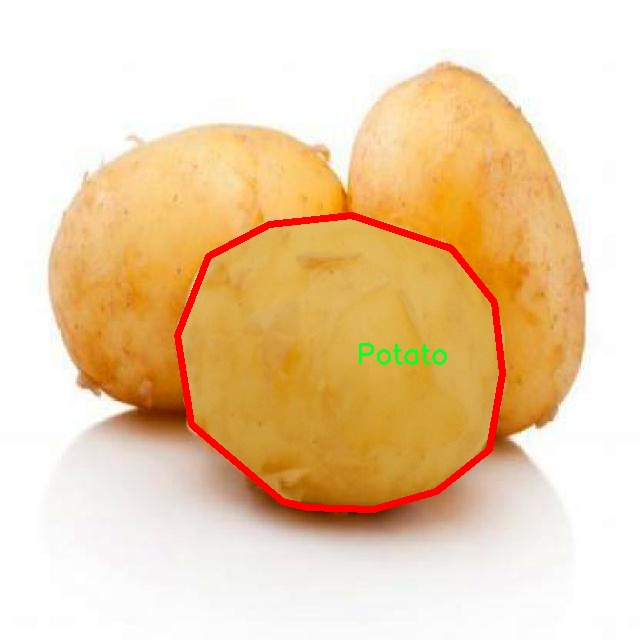
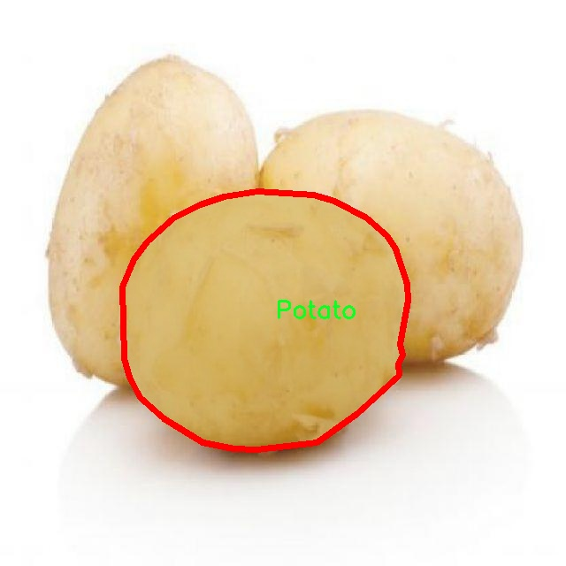

# 食品蔬菜肉类识别图像分割系统： yolov8-seg-RCSOSA

### 1.研究背景与意义

[参考博客](https://gitee.com/YOLOv8_YOLOv11_Segmentation_Studio/projects)

[博客来源](https://kdocs.cn/l/cszuIiCKVNis)

研究背景与意义

随着全球人口的不断增长和城市化进程的加快，食品安全和营养健康问题日益凸显。食品的种类繁多，尤其是蔬菜和肉类的选择，直接影响到人们的饮食结构和健康水平。因此，如何高效、准确地识别和分类各种食品，成为了计算机视觉领域的重要研究方向之一。近年来，深度学习技术的快速发展为图像识别和分割提供了新的解决方案，尤其是基于卷积神经网络（CNN）的目标检测和分割模型，如YOLO（You Only Look Once）系列，因其高效性和实时性受到广泛关注。

YOLOv8作为YOLO系列的最新版本，具有更高的准确性和更快的处理速度，适用于实时图像处理任务。然而，针对食品、蔬菜和肉类的特定应用场景，YOLOv8的标准模型可能无法满足特定的识别需求。因此，基于YOLOv8的改进模型，专注于食品图像的分割和识别，具有重要的研究意义。

本研究的核心在于构建一个基于改进YOLOv8的食品蔬菜肉类识别图像分割系统。我们使用的图像数据集包含2000张图像，涵盖21个类别，包括牛肉、苦瓜、瓶瓜、西兰花、卷心菜、胡萝卜、花椰菜、鸡肉、鸡蛋、茄子、马鲛鱼、大蒜、生姜、鲈鱼、洋葱、木瓜、猪肉、土豆、山药、鲶鱼和西红柿等。这些类别不仅丰富多样，且在日常饮食中具有重要的营养价值和经济意义。通过对这些食品的准确识别和分割，能够为食品安全监测、智能餐饮服务以及农业生产管理提供强有力的技术支持。

在技术层面，改进YOLOv8模型的研究将重点关注如何提升模型在复杂背景下的识别精度和分割效果。通过引入数据增强、迁移学习等技术手段，优化模型的训练过程，力求在保持高效性的同时，提升对不同类别食品的识别能力。此外，针对不同食品的特征，设计相应的损失函数和评价指标，以更好地适应食品图像的特性，进而提高模型的实用性。

从应用角度来看，基于改进YOLOv8的食品蔬菜肉类识别图像分割系统不仅可以应用于智能厨房、食品配送等领域，还可以为食品行业的质量控制提供数据支持，助力食品追溯体系的建立。同时，该系统的研究成果也将为相关领域的学术研究提供新的思路和方法，推动计算机视觉技术在食品安全和健康饮食中的应用。

综上所述，基于改进YOLOv8的食品蔬菜肉类识别图像分割系统的研究，不仅具有重要的理论价值和应用前景，更是应对现代社会食品安全与健康挑战的重要手段。通过本研究的深入开展，期望能够为相关领域的技术进步和社会发展贡献一份力量。

### 2.图片演示







注意：本项目提供完整的训练源码数据集和训练教程,由于此博客编辑较早,暂不提供权重文件（best.pt）,需要按照6.训练教程进行训练后实现上图效果。

### 3.视频演示

[3.1 视频演示](https://www.bilibili.com/video/BV1hABXYKEfG/)

### 4.数据集信息

##### 4.1 数据集类别数＆类别名

nc: 21
names: ['Beef', 'Bitter-Gourd', 'Bottle-Gourd', 'Broccoli', 'Cabbage', 'Carrots', 'Cauliflower', 'Chicken', 'Egg', 'Eggplant', 'Galunggong', 'Garlic', 'Ginger', 'Milkfish', 'Onion', 'Papaya', 'Pork', 'Potato', 'Sayote', 'Tilapia', 'Tomato']


##### 4.2 数据集信息简介

数据集信息展示

在本研究中，我们使用了名为“Finals_IS 2”的数据集，以改进YOLOv8-seg的食品、蔬菜和肉类识别图像分割系统。该数据集包含21个类别，涵盖了多种常见的食品和蔬菜，为训练模型提供了丰富的样本和多样化的特征。这些类别包括：牛肉（Beef）、苦瓜（Bitter-Gourd）、瓶瓜（Bottle-Gourd）、西兰花（Broccoli）、卷心菜（Cabbage）、胡萝卜（Carrots）、花椰菜（Cauliflower）、鸡肉（Chicken）、鸡蛋（Egg）、茄子（Eggplant）、鲹鱼（Galunggong）、大蒜（Garlic）、生姜（Ginger）、牛奶鱼（Milkfish）、洋葱（Onion）、木瓜（Papaya）、猪肉（Pork）、土豆（Potato）、西葫芦（Sayote）、鲑鱼（Tilapia）和西红柿（Tomato）。

该数据集的构建经过精心设计，旨在确保每个类别的样本数量和质量，以便为深度学习模型提供足够的训练数据。每个类别的图像都经过严格筛选，确保其在不同的光照、角度和背景下都能保持清晰可辨的特征。这种多样性不仅提高了模型的鲁棒性，还增强了其在实际应用中的适应能力。

在数据集的图像分割任务中，YOLOv8-seg模型将利用这些标注好的图像进行训练，以实现对不同食品类别的精准识别和分割。通过对“Finals_IS 2”数据集的深入分析，我们可以观察到各类食品在形状、颜色和纹理上的显著差异，这为模型的学习提供了丰富的特征信息。例如，牛肉和猪肉在颜色和纹理上有明显区别，而西红柿和苦瓜则在形状和颜色上各具特色。这些特征的多样性使得模型能够在训练过程中有效地学习到不同类别之间的区分特征。

此外，数据集的类别分布也经过精心设计，以避免在训练过程中出现类别不平衡的问题。每个类别的样本数量相对均衡，这样可以确保模型在训练时不会偏向某一特定类别，从而提高整体识别精度。在实际应用中，模型将能够在各种场景下准确识别和分割出食品、蔬菜和肉类，为后续的智能识别和处理提供可靠的数据支持。

总之，“Finals_IS 2”数据集为改进YOLOv8-seg的食品蔬菜肉类识别图像分割系统提供了坚实的基础。通过对多样化样本的学习，模型将能够在复杂的实际环境中实现高效的图像分割和识别，为食品安全、质量检测和智能农业等领域的应用提供强有力的技术支持。











### 5.项目依赖环境部署教程（零基础手把手教学）

[5.1 环境部署教程链接（零基础手把手教学）](https://www.bilibili.com/video/BV1jG4Ve4E9t/?vd_source=bc9aec86d164b67a7004b996143742dc)


[5.2 安装Python虚拟环境创建和依赖库安装视频教程链接（零基础手把手教学）](https://www.bilibili.com/video/BV1nA4VeYEze/?vd_source=bc9aec86d164b67a7004b996143742dc)

### 6.手把手YOLOV8-seg训练视频教程（零基础手把手教学）

[6.1 手把手YOLOV8-seg训练视频教程（零基础小白有手就能学会）](https://www.bilibili.com/video/BV1cA4VeYETe/?vd_source=bc9aec86d164b67a7004b996143742dc)


按照上面的训练视频教程链接加载项目提供的数据集，运行train.py即可开始训练



     Epoch   gpu_mem       box       obj       cls    labels  img_size
     1/200     0G   0.01576   0.01955  0.007536        22      1280: 100%|██████████| 849/849 [14:42<00:00,  1.04s/it]
               Class     Images     Labels          P          R     mAP@.5 mAP@.5:.95: 100%|██████████| 213/213 [01:14<00:00,  2.87it/s]
                 all       3395      17314      0.994      0.957      0.0957      0.0843

     Epoch   gpu_mem       box       obj       cls    labels  img_size
     2/200     0G   0.01578   0.01923  0.007006        22      1280: 100%|██████████| 849/849 [14:44<00:00,  1.04s/it]
               Class     Images     Labels          P          R     mAP@.5 mAP@.5:.95: 100%|██████████| 213/213 [01:12<00:00,  2.95it/s]
                 all       3395      17314      0.996      0.956      0.0957      0.0845

     Epoch   gpu_mem       box       obj       cls    labels  img_size
     3/200     0G   0.01561    0.0191  0.006895        27      1280: 100%|██████████| 849/849 [10:56<00:00,  1.29it/s]
               Class     Images     Labels          P          R     mAP@.5 mAP@.5:.95: 100%|███████   | 187/213 [00:52<00:00,  4.04it/s]
                 all       3395      17314      0.996      0.957      0.0957      0.0845


### 7.50+种全套YOLOV8-seg创新点加载调参实验视频教程（一键加载写好的改进模型的配置文件）

[7.1 50+种全套YOLOV8-seg创新点加载调参实验视频教程（一键加载写好的改进模型的配置文件）](https://www.bilibili.com/video/BV1Hw4VePEXv/?vd_source=bc9aec86d164b67a7004b996143742dc)

### YOLOV8-seg算法简介

原始YOLOv8-seg算法原理

YOLOv8-seg算法是YOLO系列目标检测模型的最新进展，由Glenn-Jocher提出，旨在进一步提升目标检测和分割的性能。该算法在YOLOv5的基础上进行了多项创新，特别是在数据预处理、网络结构、特征融合和标签分配策略等方面的改进，使其在精度和速度上均表现出色。

首先，YOLOv8-seg在数据预处理阶段延续了YOLOv5的策略，采用了多种数据增强技术，以提高模型的泛化能力和鲁棒性。具体而言，算法使用了马赛克增强、混合增强、空间扰动和颜色扰动等四种增强手段。这些方法不仅增加了训练样本的多样性，还有效地提升了模型对不同场景和光照条件的适应能力。马赛克增强通过将多张图像拼接在一起，生成新的训练样本，从而增强了模型对复杂背景的识别能力；而混合增强则通过对图像进行随机组合，进一步丰富了数据集的特征分布。

在网络结构方面，YOLOv8-seg继承了YOLOv5的主干网络设计，但进行了显著的改进。原有的C3模块被替换为新的C2f模块，后者通过引入更多的分支来丰富梯度回传时的支流。这种设计不仅增强了特征提取的能力，还改善了网络的梯度流动，使得模型在训练过程中能够更有效地学习到重要的特征信息。此外，YOLOv8-seg仍然采用了特征金字塔网络（FPN）和路径聚合网络（PAN）的结构，以实现多尺度特征的充分融合。这种结构能够有效地捕捉不同尺度的目标信息，提升模型在处理复杂场景时的表现。

在检测头的设计上，YOLOv8-seg引入了解耦头结构，分为两个并行的分支，分别用于提取类别特征和位置特征。这种解耦的设计使得模型在分类和定位任务上能够更为专注，从而提高了检测的精度。通过一层1×1的卷积，模型能够独立地完成分类和定位的任务，这种结构的灵活性使得YOLOv8-seg在面对多样化的目标时，能够更好地适应不同的需求。

标签分配策略的改进也是YOLOv8-seg的一大亮点。与YOLOv5依赖于候选框聚类的方式不同，YOLOv8-seg采用了动态标签分配策略，具体实现上与YOLOv6的TOOD策略相似。这种策略通过对目标框和目标分数的动态调整，解决了正负样本匹配的多尺度分配问题。YOLOv8-seg的损失函数主要包括类别损失和位置损失，其中类别损失采用了变焦损失（VFL Loss），而回归损失则结合了CIoULoss与DFLLoss。这种设计不仅提升了模型对高质量样本的关注度，还有效降低了负样本对整体损失的影响，使得模型在训练过程中能够更好地聚焦于重要的正样本。

此外，YOLOv8-seg在轻量化方面也进行了优化，特别是在YOLOv8n版本中，通过使用更轻量化的C2f模块和减少降采样层，显著降低了模型的计算复杂度。这种轻量化设计使得YOLOv8n能够在移动设备和边缘计算环境中高效运行，满足实时检测的需求。

总的来说，YOLOv8-seg算法通过在数据预处理、网络结构、特征融合和标签分配策略等多个方面的创新，显著提升了目标检测和分割的性能。其灵活的网络设计和高效的训练策略，使得YOLOv8-seg在处理复杂场景时表现出色，成为当前目标检测领域的重要工具。随着YOLOv8-seg的推广应用，预计将在自动驾驶、智能监控、医疗影像等多个领域发挥重要作用，为相关研究和应用提供强有力的支持。


### 9.系统功能展示（检测对象为举例，实际内容以本项目数据集为准）

图9.1.系统支持检测结果表格显示

  图9.2.系统支持置信度和IOU阈值手动调节

  图9.3.系统支持自定义加载权重文件best.pt(需要你通过步骤5中训练获得)

  图9.4.系统支持摄像头实时识别

  图9.5.系统支持图片识别

  图9.6.系统支持视频识别

  图9.7.系统支持识别结果文件自动保存

  图9.8.系统支持Excel导出检测结果数据


### 10.50+种全套YOLOV8-seg创新点原理讲解（非科班也可以轻松写刊发刊，V11版本正在科研待更新）

#### 10.1 由于篇幅限制，每个创新点的具体原理讲解就不一一展开，具体见下列网址中的创新点对应子项目的技术原理博客网址【Blog】：


[10.1 50+种全套YOLOV8-seg创新点原理讲解链接](https://gitee.com/qunmasj/good)

#### 10.2 部分改进模块原理讲解(完整的改进原理见上图和技术博客链接)【如果此小节的图加载失败可以通过CSDN或者Github搜索该博客的标题访问原始博客，原始博客图片显示正常】
### 全维动态卷积ODConv
鉴于上述讨论，我们的ODConv引入了一种多维注意机制，该机制具有并行策略，用于学习卷积核在核空间的所有四个维度上的不同注意。图提供了CondConv、DyConv和ODConv的示意性比较。

ODConv的公式：根据等式1中的符号，ODConv可定义为


 将注意力标量分配给整个卷积核。图2示出了将这四种类型的关注乘以n个卷积核的过程。原则上，这四种类型的关注是相互补充的，并且以位置、信道、滤波器和核的顺序将它们逐步乘以卷积核 
 ，使得卷积运算不同w.r.t.所有空间位置、所有输入信道、所有滤波器和输入x的所有核，提供捕获丰富上下文线索的性能保证。因此，ODConv可以显著增强CNN基本卷积运算的特征提取能力。此外，具有单个卷积核的ODConv可以与标准CondConv和DyConv竞争或优于它们，为最终模型引入的额外参数大大减少。提供了大量实验来验证这些优点。通过比较等式1和等式2，我们可以清楚地看到，ODConv是一种更广义的动态卷积。此外，当设置n=1且 所有分量均为1时，只关注滤波器方向 的ODConv将减少为：将基于输入特征的SE变量应用于卷积滤波器，然后进行卷积运算（注意原始SE（Hu等人，2018b）基于输出特征，并且用于重新校准输出特征本身）。这种SE变体是ODConv的特例。


图：将ODConv中的四种注意类型逐步乘以卷积核的示例。（a） 沿空间维度的逐位置乘法运算，（b）沿输入信道维度的逐信道乘法运算、（c）沿输出信道维度的按滤波器乘法运算，以及（d）沿卷积核空间的核维度的按核乘法运算。方法部分对符号进行了说明
实现：对于ODConv，一个关键问题是如何计算卷积核的四种关注度 。继CondConv和DyConv之后，我们还使用SE型注意力模块（Hu等人，2018b），但将多个头部作为来计算它们，其结构如图所示。具体而言，首先通过逐通道全局平均池（GAP）运算将输入压缩到具有长度的特征向量中。随后，存在完全连接（FC）层和四个头部分支。ReLU（Krizhevsky等人，2012）位于FC层之后。FC层将压缩特征向量映射到具有缩减比的低维空间（根据消融实验，我们在所有主要实验中设置 ，避免了高模型复杂度）。对于四个头部分支，每个分支都有一个输出大小如图。

### 引入ODConv的改进YOLO
参考这篇博客涵盖了引入ODConv的改进YOLOv8系统的内容，ODConv采用多维注意机制，在卷积核空间的四个维度上学习不同的注意。结合了CondConv和DyConv的优势，ODConv通过图示的四种注意类型逐步与卷积核相乘，以捕获丰富的上下文线索，提升特征提取能力。

#### ODConv结构与方法
ODConv的公式和图示展示了其关注力分配给卷积核的方式，其中四种类型的关注以位置、信道、滤波器和核的顺序逐步与卷积核相乘。这种结构保证了卷积运算不同于标准的Conv操作，能够捕获更多上下文信息，从而增强了CNN的特征提取能力。另外，单个卷积核的ODConv在性能上能够与CondConv和DyConv相竞争，并且引入的额外参数大幅减少。

ODConv的特殊之处在于其广义的动态卷积性质，同时在特定条件下（n=1且所有分量为1），它可以退化为一种特例，即只关注滤波器方向，这类似于基于输入特征的SE变体，但不同于原始SE，它基于输出特征。

#### ODConv的实现
关键问题在于如何计算卷积核的四种关注度。ODConv采用了SE型注意力模块，结合了多个头部来计算这些关注度。具体实现上，通过逐通道全局平均池运算和完全连接层，将输入压缩为特征向量，随后使用四个头部分支来计算四种不同类型的关注。这样的结构能在保持模型复杂度可控的情况下，提升了特征的表征能力。

ODConv的引入为YOLOv8带来了显著的性能提升，并且通过大量实验证明了其在特征提取方面的优越性。其结合了多维注意机制和卷积操作，为目标检测和分拣系统的提升带来了新的思路和性能突破。


### 11.项目核心源码讲解（再也不用担心看不懂代码逻辑）

#### 11.1 ultralytics\models\sam\modules\__init__.py

当然可以！不过你提供的代码片段非常简短，仅包含了一个注释行。为了更好地帮助你，我需要更完整的代码或文件内容。请提供更多的代码，以便我能够分析并提取出核心部分，并进行详细的中文注释。

这个文件是Ultralytics YOLO项目的一部分，主要用于模型的实现和模块的组织。文件开头的注释说明了该项目使用的是AGPL-3.0许可证，这意味着该项目是开源的，用户可以自由使用、修改和分发，但在分发修改后的版本时需要遵循相同的许可证条款。

虽然文件内容非常简短，仅包含了一行注释，但它的存在是为了明确该模块的归属和许可证信息。在大型项目中，模块的组织和许可证声明是非常重要的，能够帮助用户了解代码的使用限制和版权信息。

通常，在这样的`__init__.py`文件中，可能会包含一些初始化代码，或者用于导入其他模块和类，使得该目录可以被视为一个包。然而，在这个特定的文件中，似乎没有包含其他代码或导入语句。这样的设计可能是为了保持模块的简洁性，或者是因为该模块的功能在其他文件中实现。

总的来说，这个文件的主要作用是提供项目的基本信息和许可证声明，为后续的模块和功能打下基础。

#### 11.2 ultralytics\utils\callbacks\base.py

以下是经过简化和注释的核心代码部分：

```python
# Ultralytics YOLO 🚀, AGPL-3.0 license
"""基础回调函数定义模块。"""

from collections import defaultdict
from copy import deepcopy

# 定义训练过程中的回调函数
def on_train_start(trainer):
    """训练开始时调用的回调函数。"""
    pass

def on_train_epoch_end(trainer):
    """每个训练周期结束时调用的回调函数。"""
    pass

def on_train_end(trainer):
    """训练结束时调用的回调函数。"""
    pass

# 定义验证过程中的回调函数
def on_val_start(validator):
    """验证开始时调用的回调函数。"""
    pass

def on_val_end(validator):
    """验证结束时调用的回调函数。"""
    pass

# 定义预测过程中的回调函数
def on_predict_start(predictor):
    """预测开始时调用的回调函数。"""
    pass

def on_predict_end(predictor):
    """预测结束时调用的回调函数。"""
    pass

# 定义导出过程中的回调函数
def on_export_start(exporter):
    """模型导出开始时调用的回调函数。"""
    pass

def on_export_end(exporter):
    """模型导出结束时调用的回调函数。"""
    pass

# 默认回调函数字典
default_callbacks = {
    'on_train_start': [on_train_start],
    'on_train_epoch_end': [on_train_epoch_end],
    'on_train_end': [on_train_end],
    'on_val_start': [on_val_start],
    'on_val_end': [on_val_end],
    'on_predict_start': [on_predict_start],
    'on_predict_end': [on_predict_end],
    'on_export_start': [on_export_start],
    'on_export_end': [on_export_end]
}

def get_default_callbacks():
    """
    返回一个包含默认回调函数的字典，字典的值为默认空列表。

    Returns:
        (defaultdict): 一个包含默认回调函数的字典。
    """
    return defaultdict(list, deepcopy(default_callbacks))

def add_integration_callbacks(instance):
    """
    将各种来源的集成回调添加到实例的回调字典中。

    Args:
        instance (Trainer, Predictor, Validator, Exporter): 一个具有 'callbacks' 属性的对象，该属性是一个回调列表的字典。
    """
    # 加载其他回调
    from .hub import callbacks as hub_cb
    callbacks_list = [hub_cb]

    # 如果实例是训练器，则加载训练相关的回调
    if 'Trainer' in instance.__class__.__name__:
        from .clearml import callbacks as clear_cb
        from .comet import callbacks as comet_cb
        # 其他回调的加载...
        callbacks_list.extend([clear_cb, comet_cb])

    # 将加载的回调添加到实例的回调字典中
    for callbacks in callbacks_list:
        for k, v in callbacks.items():
            if v not in instance.callbacks[k]:
                instance.callbacks[k].append(v)
```

### 代码说明：
1. **回调函数**：定义了一系列回调函数，用于在训练、验证、预测和导出过程中触发特定操作。
2. **默认回调字典**：`default_callbacks` 字典包含了所有定义的回调函数，便于在训练过程中调用。
3. **获取默认回调**：`get_default_callbacks` 函数返回一个深拷贝的默认回调字典，确保原始字典不被修改。
4. **集成回调**：`add_integration_callbacks` 函数允许将其他来源的回调集成到当前实例的回调字典中，以便扩展功能。

这个程序文件是Ultralytics YOLO项目中的一个回调函数基类实现，主要用于在训练、验证、预测和导出模型的不同阶段执行特定的操作。回调函数是深度学习训练过程中非常重要的组成部分，它们可以帮助用户在特定事件发生时插入自定义代码，以便于监控训练过程、调整参数、保存模型等。

文件中定义了一系列的回调函数，这些函数在不同的训练阶段被调用。每个回调函数都接收一个参数，通常是当前的训练器、验证器、预测器或导出器实例。函数的具体实现目前是空的（使用`pass`语句），这意味着用户可以根据需要在这些函数中添加自定义逻辑。

回调函数分为几个部分：训练回调、验证回调、预测回调和导出回调。训练回调包括在训练开始、每个训练周期开始、每个训练批次开始和结束等多个阶段的回调函数。验证回调则是在验证过程的开始和结束时调用的函数。预测回调在进行模型预测时被调用，而导出回调则是在模型导出时执行。

此外，文件中还定义了一个`default_callbacks`字典，它将每个回调函数与其对应的事件关联起来。这个字典可以帮助管理和调用这些回调函数。

`get_default_callbacks`函数返回一个默认回调字典的副本，使用`defaultdict`确保每个键都有一个空列表作为默认值。这使得在使用回调时更加灵活，便于后续的扩展和修改。

`add_integration_callbacks`函数用于将来自不同来源的集成回调添加到给定实例的回调字典中。它首先加载一些特定的回调模块（如hub、clearml、comet等），然后根据实例的类型（如Trainer、Predictor等）选择性地添加相关的回调。这种设计使得系统能够灵活地集成多种工具和库，增强了模型训练和评估的功能。

总体而言，这个文件为Ultralytics YOLO项目提供了一个结构化的回调机制，使得用户能够在训练和评估过程中灵活地插入自定义逻辑，从而提高模型的性能和可操作性。

#### 11.3 ultralytics\models\fastsam\__init__.py

以下是保留的核心代码部分，并附上详细的中文注释：

```python
# 导入必要的模块和类
from .model import FastSAM  # 导入FastSAM模型类
from .predict import FastSAMPredictor  # 导入FastSAMPredictor类，用于进行预测
from .prompt import FastSAMPrompt  # 导入FastSAMPrompt类，用于处理提示信息
from .val import FastSAMValidator  # 导入FastSAMValidator类，用于验证模型性能

# 定义模块的公开接口，包含可以被外部访问的类
__all__ = 'FastSAMPredictor', 'FastSAM', 'FastSAMPrompt', 'FastSAMValidator'
```

### 代码注释说明：
1. **导入模块**：
   - `from .model import FastSAM`：从当前包的`model`模块中导入`FastSAM`类，该类可能是实现了某种深度学习模型的核心部分。
   - `from .predict import FastSAMPredictor`：从`predict`模块中导入`FastSAMPredictor`类，负责使用模型进行预测的功能。
   - `from .prompt import FastSAMPrompt`：从`prompt`模块中导入`FastSAMPrompt`类，可能用于处理用户输入或提示信息，以便于模型理解。
   - `from .val import FastSAMValidator`：从`val`模块中导入`FastSAMValidator`类，用于评估和验证模型的性能。

2. **定义公开接口**：
   - `__all__`：这是一个特殊的变量，用于定义当使用`from module import *`时，哪些名称是可以被导入的。这里列出了四个类，表示它们是该模块的公共接口，可以被外部代码使用。

这个程序文件是一个Python模块的初始化文件，文件名为`__init__.py`，位于`ultralytics\models\fastsam`目录下。该文件的主要功能是定义模块的公共接口，并导入该模块中其他文件中的类或函数。

首先，文件顶部的注释表明该项目是Ultralytics YOLO的一部分，并且遵循AGPL-3.0许可证。这说明该项目是开源的，用户可以自由使用和修改，但需要遵循相应的许可证条款。

接下来，文件通过`from ... import ...`语句导入了四个组件：`FastSAM`、`FastSAMPredictor`、`FastSAMPrompt`和`FastSAMValidator`。这些组件分别来自于同一目录下的不同模块文件。具体来说：

- `FastSAM`可能是一个核心模型类，负责实现FastSAM算法的主要功能。
- `FastSAMPredictor`是一个预测器类，可能用于处理输入数据并生成预测结果。
- `FastSAMPrompt`可能与用户输入或提示相关，提供交互式功能或设置。
- `FastSAMValidator`则可能用于验证模型的性能或结果，确保输出的准确性和可靠性。

最后，`__all__`变量定义了该模块的公共接口，指定了当使用`from fastsam import *`语句时，哪些名称会被导入。这里列出的四个组件都将被视为模块的公共部分，方便用户在使用时直接调用。

总的来说，这个初始化文件的作用是将FastSAM相关的功能模块组织在一起，并提供一个清晰的接口供外部使用。

#### 11.4 ultralytics\models\nas\predict.py

以下是经过简化和注释的核心代码部分：

```python
import torch
from ultralytics.engine.predictor import BasePredictor
from ultralytics.engine.results import Results
from ultralytics.utils import ops

class NASPredictor(BasePredictor):
    """
    Ultralytics YOLO NAS 预测器，用于目标检测。

    该类扩展了 Ultralytics 引擎中的 `BasePredictor`，负责对 YOLO NAS 模型生成的原始预测结果进行后处理。
    包括非极大值抑制（NMS）和将边界框缩放到原始图像尺寸等操作。

    属性:
        args (Namespace): 包含各种后处理配置的命名空间。
    """

    def postprocess(self, preds_in, img, orig_imgs):
        """对预测结果进行后处理，并返回 Results 对象的列表。"""

        # 将预测框转换为 xywh 格式，并与类分数拼接
        boxes = ops.xyxy2xywh(preds_in[0][0])  # 将预测框从 xyxy 格式转换为 xywh 格式
        preds = torch.cat((boxes, preds_in[0][1]), -1).permute(0, 2, 1)  # 拼接框和分数，并调整维度

        # 应用非极大值抑制（NMS）以过滤重叠的框
        preds = ops.non_max_suppression(preds,
                                        self.args.conf,  # 置信度阈值
                                        self.args.iou,   # IOU 阈值
                                        agnostic=self.args.agnostic_nms,  # 是否类别无关的 NMS
                                        max_det=self.args.max_det,  # 最大检测框数量
                                        classes=self.args.classes)  # 过滤的类别

        # 如果输入图像不是列表，则将其转换为 numpy 数组
        if not isinstance(orig_imgs, list):
            orig_imgs = ops.convert_torch2numpy_batch(orig_imgs)

        results = []  # 初始化结果列表
        for i, pred in enumerate(preds):  # 遍历每个预测结果
            orig_img = orig_imgs[i]  # 获取原始图像
            # 将预测框缩放到原始图像的尺寸
            pred[:, :4] = ops.scale_boxes(img.shape[2:], pred[:, :4], orig_img.shape)
            img_path = self.batch[0][i]  # 获取图像路径
            # 创建 Results 对象并添加到结果列表
            results.append(Results(orig_img, path=img_path, names=self.model.names, boxes=pred))
        return results  # 返回结果列表
```

### 代码注释说明：
1. **类定义**：`NASPredictor` 类继承自 `BasePredictor`，用于处理 YOLO NAS 模型的预测结果。
2. **postprocess 方法**：这是主要的后处理方法，接收原始预测结果、输入图像和原始图像，并返回处理后的结果。
3. **框转换**：使用 `ops.xyxy2xywh` 将预测框格式从 `xyxy` 转换为 `xywh`，方便后续处理。
4. **非极大值抑制**：通过 `ops.non_max_suppression` 方法过滤掉重叠的框，保留最有可能的检测结果。
5. **图像转换**：如果原始图像不是列表格式，则将其转换为 NumPy 数组，以便于后续处理。
6. **结果构建**：遍历每个预测结果，缩放边界框到原始图像尺寸，并创建 `Results` 对象，最终返回所有结果。

这个程序文件是Ultralytics YOLO NAS模型的预测器，主要用于目标检测任务。它继承自Ultralytics引擎中的`BasePredictor`类，负责对YOLO NAS模型生成的原始预测结果进行后处理。后处理的步骤包括非极大值抑制（NMS）和将边界框缩放到原始图像的尺寸。

在这个类中，有一个主要的方法`postprocess`，它接收原始预测结果、输入图像以及原始图像的列表。首先，它将预测结果中的边界框从xyxy格式转换为xywh格式，并将边界框与相应的类分数合并。接着，调用非极大值抑制函数，去除重叠度高的边界框，以减少冗余的检测结果。

在处理原始图像时，如果输入的图像不是列表格式（即是一个torch.Tensor），则会将其转换为NumPy数组格式。随后，程序会遍历每个预测结果，并根据原始图像的尺寸调整边界框的坐标。最后，创建一个`Results`对象的列表，包含每个原始图像、路径、类别名称和处理后的边界框信息。

需要注意的是，这个类通常不会被直接实例化，而是在`NAS`类内部使用。通过这个预测器，用户可以方便地对YOLO NAS模型的输出进行处理，获取最终的检测结果。

#### 11.5 ultralytics\data\augment.py

以下是经过简化和注释的核心代码部分，主要包括图像变换和增强的类。注释详细解释了每个类和方法的功能。

```python
import random
import numpy as np
import cv2

class BaseTransform:
    """
    图像变换的基类，定义了一些基本的图像处理方法。
    """

    def __init__(self) -> None:
        """初始化 BaseTransform 对象。"""
        pass

    def apply_image(self, labels):
        """应用图像变换到标签。"""
        pass

    def apply_instances(self, labels):
        """应用变换到标签中的对象实例。"""
        pass

    def apply_semantic(self, labels):
        """应用语义分割变换到图像。"""
        pass

    def __call__(self, labels):
        """应用所有标签变换到图像、实例和语义掩码。"""
        self.apply_image(labels)
        self.apply_instances(labels)
        self.apply_semantic(labels)


class Compose:
    """
    组合多个图像变换的类。
    """

    def __init__(self, transforms):
        """初始化 Compose 对象，接收变换列表。"""
        self.transforms = transforms

    def __call__(self, data):
        """对输入数据应用一系列变换。"""
        for t in self.transforms:
            data = t(data)
        return data


class RandomFlip:
    """
    随机水平或垂直翻转图像的类。
    """

    def __init__(self, p=0.5, direction='horizontal') -> None:
        """
        初始化 RandomFlip 类，设置翻转概率和方向。
        
        Args:
            p (float): 翻转的概率，范围在 0 到 1 之间。
            direction (str): 翻转方向，支持 'horizontal' 或 'vertical'。
        """
        assert direction in ['horizontal', 'vertical'], f'不支持的方向: {direction}'
        assert 0 <= p <= 1.0
        self.p = p
        self.direction = direction

    def __call__(self, labels):
        """
        对图像应用随机翻转，并相应更新实例（边界框、关键点等）。
        
        Args:
            labels (dict): 包含 'img' 和 'instances' 的字典。
        
        Returns:
            dict: 更新后的字典，包含翻转后的图像和实例。
        """
        img = labels['img']
        instances = labels.pop('instances')
        h, w = img.shape[:2]

        # 垂直翻转
        if self.direction == 'vertical' and random.random() < self.p:
            img = np.flipud(img)
            instances.flipud(h)
        # 水平翻转
        if self.direction == 'horizontal' and random.random() < self.p:
            img = np.fliplr(img)
            instances.fliplr(w)

        labels['img'] = img
        labels['instances'] = instances
        return labels


class LetterBox:
    """
    用于检测、实例分割和姿态估计的图像调整和填充类。
    """

    def __init__(self, new_shape=(640, 640), stride=32):
        """初始化 LetterBox 对象，设置目标形状和步幅。"""
        self.new_shape = new_shape
        self.stride = stride

    def __call__(self, labels=None, image=None):
        """返回更新后的标签和图像，添加边框。"""
        img = labels.get('img') if image is None else image
        shape = img.shape[:2]  # 当前形状 [高度, 宽度]
        new_shape = self.new_shape

        # 计算缩放比例
        r = min(new_shape[0] / shape[0], new_shape[1] / shape[1])
        new_unpad = int(round(shape[1] * r)), int(round(shape[0] * r))
        dw, dh = new_shape[1] - new_unpad[0], new_shape[0] - new_unpad[1]  # 宽高填充

        # 计算填充
        dw /= 2  # 将填充分配到两侧
        dh /= 2

        # 调整图像大小
        img = cv2.resize(img, new_unpad, interpolation=cv2.INTER_LINEAR)
        top, bottom = int(round(dh)), int(round(dh))
        left, right = int(round(dw)), int(round(dw))
        img = cv2.copyMakeBorder(img, top, bottom, left, right, cv2.BORDER_CONSTANT, value=(114, 114, 114))  # 添加边框

        labels['img'] = img
        labels['resized_shape'] = new_shape
        return labels


# 示例：组合变换
def v8_transforms(dataset, imgsz):
    """将图像转换为适合 YOLOv8 训练的大小。"""
    return Compose([
        LetterBox(new_shape=(imgsz, imgsz)),
        RandomFlip(direction='horizontal', p=0.5),
        RandomFlip(direction='vertical', p=0.5)
    ])
```

### 代码说明：
1. **BaseTransform**: 这是一个基类，定义了图像变换的基本接口，具体的变换方法需要在子类中实现。
2. **Compose**: 这个类用于将多个变换组合在一起，并按顺序应用到输入数据上。
3. **RandomFlip**: 这个类实现了随机翻转图像的功能，可以选择水平或垂直翻转，并更新相应的实例信息。
4. **LetterBox**: 这个类用于调整图像大小并添加边框，以适应特定的输入形状，常用于目标检测任务。
5. **v8_transforms**: 这是一个示例函数，展示了如何组合使用这些变换，以适应 YOLOv8 的训练需求。

这个程序文件 `ultralytics\data\augment.py` 主要用于图像数据增强，特别是在目标检测和图像分类任务中。文件中定义了多个类和方法，用于实现不同的图像增强技术。以下是对文件内容的详细说明。

首先，文件引入了一些必要的库，包括数学计算、随机数生成、OpenCV、NumPy、PyTorch等。这些库为后续的图像处理和增强提供了基础。

文件中定义了一个基类 `BaseTransform`，用于处理图像的基本变换。该类提供了几个方法，包括 `apply_image`、`apply_instances` 和 `apply_semantic`，这些方法的具体实现留待子类完成。`__call__` 方法则用于将所有变换应用于输入的标签。

接下来是 `Compose` 类，它允许将多个图像变换组合在一起。这个类的 `__call__` 方法会依次应用所有变换，并返回处理后的数据。

`BaseMixTransform` 类是一个用于混合增强（如 MixUp 和 Mosaic）的基类。它包含了获取索引和应用混合变换的基本框架。具体的混合方法在其子类中实现。

`Mosaic` 类实现了马赛克增强，通过将多个图像组合成一个马赛克图像来增强数据。该类的构造函数接受数据集、图像大小、增强概率等参数。`_mosaic4` 和 `_mosaic9` 方法分别实现了 2x2 和 3x3 的马赛克组合。

`MixUp` 类则实现了 MixUp 增强技术，通过对两张图像进行加权平均来生成新的图像。它的 `get_indexes` 方法随机选择一张图像进行混合。

`RandomPerspective` 类实现了随机透视变换和仿射变换，可以对图像进行旋转、平移、缩放和剪切等操作。它的 `__call__` 方法将这些变换应用于输入的标签。

`RandomHSV` 类用于随机调整图像的色调、饱和度和亮度。它通过在 HSV 空间中进行随机变换来实现。

`RandomFlip` 类实现了随机翻转图像的功能，可以选择水平或垂直翻转，并相应地更新实例的边界框和关键点。

`LetterBox` 类用于调整图像大小并进行填充，以适应目标检测和实例分割的需求。它可以保持图像的纵横比，并在图像周围添加边框。

`CopyPaste` 类实现了 Copy-Paste 增强技术，通过将一个图像的实例复制到另一个图像上来增强数据。

`Albumentations` 类提供了一系列基于 Albumentations 库的增强方法，包括模糊、对比度调整等。它的实现是可选的，只有在安装了该库的情况下才会生效。

`Format` 类用于格式化图像注释，以便在 PyTorch 的 DataLoader 中使用。它标准化了图像和实例注释的格式。

最后，文件还定义了一些函数，如 `v8_transforms` 和 `classify_transforms`，用于生成适合 YOLOv8 训练的图像变换组合。

整体来看，这个文件提供了丰富的图像增强功能，旨在提高模型的泛化能力和鲁棒性，适用于目标检测和图像分类等任务。

### 12.系统整体结构（节选）

### 程序整体功能和构架概括

Ultralytics YOLO项目是一个开源的目标检测框架，旨在提供高效、灵活的模型训练和推理工具。该项目采用模块化设计，包含多个子模块，每个子模块负责特定的功能。整体架构包括模型定义、数据处理、增强、回调机制等部分，旨在为用户提供一个易于使用和扩展的深度学习平台。

- **模型模块**：包括不同的模型实现，如YOLO和FastSAM，负责目标检测的核心算法。
- **数据处理模块**：负责数据的加载、增强和预处理，以提高模型的训练效果。
- **回调机制**：允许用户在训练过程中插入自定义逻辑，以便于监控和调整训练过程。
- **预测模块**：处理模型的输出，进行后处理以生成最终的检测结果。

### 文件功能整理表

| 文件路径                                           | 功能描述                                                                                      |
|--------------------------------------------------|-----------------------------------------------------------------------------------------------|
| `ultralytics/models/sam/modules/__init__.py`    | 定义FastSAM模块的公共接口，导入相关类和函数，提供模块的基本信息和许可证声明。                |
| `ultralytics/utils/callbacks/base.py`           | 定义回调函数的基类，提供训练、验证、预测和导出过程中的回调机制，允许用户插入自定义逻辑。     |
| `ultralytics/models/fastsam/__init__.py`        | 定义FastSAM相关模块的公共接口，导入核心模型和相关功能，方便用户使用。                       |
| `ultralytics/models/nas/predict.py`              | 实现YOLO NAS模型的预测功能，负责对模型输出进行后处理，包括非极大值抑制和边界框调整。       |
| `ultralytics/data/augment.py`                    | 提供多种图像数据增强技术，包括马赛克、MixUp、随机翻转等，旨在提高模型的泛化能力和鲁棒性。   |

通过以上表格，可以清晰地了解每个文件的功能及其在Ultralytics YOLO项目中的作用。这种模块化的设计使得代码易于维护和扩展，同时也提高了用户的使用体验。

### 13.图片、视频、摄像头图像分割Demo(去除WebUI)代码

在这个博客小节中，我们将讨论如何在不使用WebUI的情况下，实现图像分割模型的使用。本项目代码已经优化整合，方便用户将分割功能嵌入自己的项目中。
核心功能包括图片、视频、摄像头图像的分割，ROI区域的轮廓提取、类别分类、周长计算、面积计算、圆度计算以及颜色提取等。
这些功能提供了良好的二次开发基础。

### 核心代码解读

以下是主要代码片段，我们会为每一块代码进行详细的批注解释：

```python
import random
import cv2
import numpy as np
from PIL import ImageFont, ImageDraw, Image
from hashlib import md5
from model import Web_Detector
from chinese_name_list import Label_list

# 根据名称生成颜色
def generate_color_based_on_name(name):
    ......

# 计算多边形面积
def calculate_polygon_area(points):
    return cv2.contourArea(points.astype(np.float32))

...
# 绘制中文标签
def draw_with_chinese(image, text, position, font_size=20, color=(255, 0, 0)):
    image_pil = Image.fromarray(cv2.cvtColor(image, cv2.COLOR_BGR2RGB))
    draw = ImageDraw.Draw(image_pil)
    font = ImageFont.truetype("simsun.ttc", font_size, encoding="unic")
    draw.text(position, text, font=font, fill=color)
    return cv2.cvtColor(np.array(image_pil), cv2.COLOR_RGB2BGR)

# 动态调整参数
def adjust_parameter(image_size, base_size=1000):
    max_size = max(image_size)
    return max_size / base_size

# 绘制检测结果
def draw_detections(image, info, alpha=0.2):
    name, bbox, conf, cls_id, mask = info['class_name'], info['bbox'], info['score'], info['class_id'], info['mask']
    adjust_param = adjust_parameter(image.shape[:2])
    spacing = int(20 * adjust_param)

    if mask is None:
        x1, y1, x2, y2 = bbox
        aim_frame_area = (x2 - x1) * (y2 - y1)
        cv2.rectangle(image, (x1, y1), (x2, y2), color=(0, 0, 255), thickness=int(3 * adjust_param))
        image = draw_with_chinese(image, name, (x1, y1 - int(30 * adjust_param)), font_size=int(35 * adjust_param))
        y_offset = int(50 * adjust_param)  # 类别名称上方绘制，其下方留出空间
    else:
        mask_points = np.concatenate(mask)
        aim_frame_area = calculate_polygon_area(mask_points)
        mask_color = generate_color_based_on_name(name)
        try:
            overlay = image.copy()
            cv2.fillPoly(overlay, [mask_points.astype(np.int32)], mask_color)
            image = cv2.addWeighted(overlay, 0.3, image, 0.7, 0)
            cv2.drawContours(image, [mask_points.astype(np.int32)], -1, (0, 0, 255), thickness=int(8 * adjust_param))

            # 计算面积、周长、圆度
            area = cv2.contourArea(mask_points.astype(np.int32))
            perimeter = cv2.arcLength(mask_points.astype(np.int32), True)
            ......

            # 计算色彩
            mask = np.zeros(image.shape[:2], dtype=np.uint8)
            cv2.drawContours(mask, [mask_points.astype(np.int32)], -1, 255, -1)
            color_points = cv2.findNonZero(mask)
            ......

            # 绘制类别名称
            x, y = np.min(mask_points, axis=0).astype(int)
            image = draw_with_chinese(image, name, (x, y - int(30 * adjust_param)), font_size=int(35 * adjust_param))
            y_offset = int(50 * adjust_param)

            # 绘制面积、周长、圆度和色彩值
            metrics = [("Area", area), ("Perimeter", perimeter), ("Circularity", circularity), ("Color", color_str)]
            for idx, (metric_name, metric_value) in enumerate(metrics):
                ......

    return image, aim_frame_area

# 处理每帧图像
def process_frame(model, image):
    pre_img = model.preprocess(image)
    pred = model.predict(pre_img)
    det = pred[0] if det is not None and len(det)
    if det:
        det_info = model.postprocess(pred)
        for info in det_info:
            image, _ = draw_detections(image, info)
    return image

if __name__ == "__main__":
    cls_name = Label_list
    model = Web_Detector()
    model.load_model("./weights/yolov8s-seg.pt")

    # 摄像头实时处理
    cap = cv2.VideoCapture(0)
    while cap.isOpened():
        ret, frame = cap.read()
        if not ret:
            break
        ......

    # 图片处理
    image_path = './icon/OIP.jpg'
    image = cv2.imread(image_path)
    if image is not None:
        processed_image = process_frame(model, image)
        ......

    # 视频处理
    video_path = ''  # 输入视频的路径
    cap = cv2.VideoCapture(video_path)
    while cap.isOpened():
        ret, frame = cap.read()
        ......
```


### 14.完整训练+Web前端界面+50+种创新点源码、数据集获取


# [下载链接：https://mbd.pub/o/bread/Z5mYmp9q](https://mbd.pub/o/bread/Z5mYmp9q)